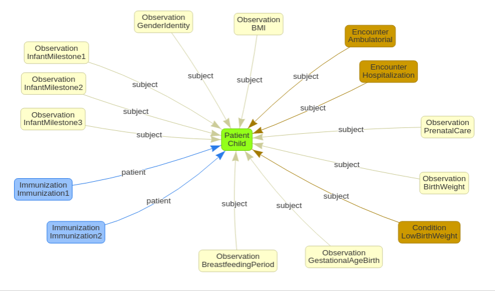

Child development indicators
======================================================================

Here we present a proposal for initial indicators relevant for monitoring child development.

The *Indicator* column refers to the high-level concepts that will be monitored by the system.
The table below relates the indicators to typical health-related data sources.
The data required for the calculation of the indicators are mapped to HL7 FHIR Resources to ensure a minimal interoperability between health systems.

+------------------------------------+----------------------------------------------------------------------+-------------------------+--------------------------------------------------------------------------------------------------------------------------------------------------------------------------------------------------------------+
| Indicator                          |                         Potential data source                        | Potential FHIR Resource | Key FHIR elements                                                                                                                                                                                            |
+====================================+======================================================================+=========================+==========================================+===================================================================================================================================================================+
| Prenatal care incomplete or absent | Mother's appointments, exams, immunizations, nutritional supplements | `Observation <https://www.hl7.org/fhir/observation.html>`_         | category: social-history, code: 1031000119109 (SNOMED, Insufficient prenatal care)                                                                                |
|                                    |                                                                      +-------------------------+------------------------------------------+-------------------------------------------------------------------------------------------------------------------------------------------------------------------+
|                                    |                                                                      | `Condition <https://www.hl7.org/fhir/condition.html>`_             | code: 276610007 (SNOMED, Low birth weight infant (disorder))                                                                                                      |
+------------------------------------+----------------------------------------------------------------------+-------------------------+------------------------------------------+-------------------------------------------------------------------------------------------------------------------------------------------------------------------+
| Birth weight <= 2.500 g            | Weight measured at birth                                             | `Observation <https://www.hl7.org/fhir/observation.html>`_         | category: vital-signs, code: 8339-4 (LOINC, Birth weight Measured)                                                                                                |
+------------------------------------+----------------------------------------------------------------------+-------------------------+------------------------------------------+-------------------------------------------------------------------------------------------------------------------------------------------------------------------+
| Gestational age at birth < 37 wk   | Birth date, mother's last period date                                | `Observation <https://www.hl7.org/fhir/observation.html>`_         | category: vital-signs, code: 76516-4 (LOINC, Gestational age--at birth)                                                                                           |
|                                    |                                                                      +-------------------------+------------------------------------------+-------------------------------------------------------------------------------------------------------------------------------------------------------------------+
|                                    |                                                                      | `Condition <https://www.hl7.org/fhir/condition.html>`_             | code: 412726003 (SNOMED, Fetal gestational age (observable entity))                                                                                               |
+------------------------------------+----------------------------------------------------------------------+-------------------------+------------------------------------------+-------------------------------------------------------------------------------------------------------------------------------------------------------------------+
| Breastfed < 3 mo                   | Appointment, mother report                                           | `Observation <https://www.hl7.org/fhir/observation.html>`_         | code: 169746009 (SNOMED, Breastfeeding stopped)                                                                                                                   |
|                                    |                                                                      +-------------------------+------------------------------------------+-------------------------------------------------------------------------------------------------------------------------------------------------------------------+
|                                    |                                                                      | `Condition <https://www.hl7.org/fhir/condition.html>`_             | code: 169741004 (SNOMED, Breast fed (finding))                                                                                                                    |
+------------------------------------+----------------------------------------------------------------------+-------------------------+------------------------------------------+-------------------------------------------------------------------------------------------------------------------------------------------------------------------+
| Immunization schedule incomplete   | Immunization card                                                    | `Immunization <https://www.hl7.org/fhir/immunization.html>`_       | vaccineCode, occurrenceDateTime                                                                                                                                   |
+------------------------------------+----------------------------------------------------------------------+-------------------------+------------------------------------------+-------------------------------------------------------------------------------------------------------------------------------------------------------------------+
| Number of hospitalizations         | Hospital admission, patient records                                  | `Encounter <https://www.hl7.org/fhir/encounter.html>`_             | class: IMP | AMB | EMER | ACUTE                                                                                                                                   |
+------------------------------------+----------------------------------------------------------------------+-------------------------+------------------------------------------+-------------------------------------------------------------------------------------------------------------------------------------------------------------------+
| Height/Weight/BMI                  | Body measures, doctor's appointment                                  | `Observation <https://www.hl7.org/fhir/observation.html>`_         | category: vital-signs, code: 39156-5 (LOINC, BMI) | 8302-2 (LOINC, Body height) | 29463-7 (LOINC, Body weight) |                                                  |
|                                    |                                                                      |                                                                    | 9843-4 (LOINC, Weight-for-lenght per age and sex) | 59576-9 (LOINC, BMI per age and gender)                                                                       |
+------------------------------------+----------------------------------------------------------------------+-------------------------+------------------------------------------+-------------------------------------------------------------------------------------------------------------------------------------------------------------------+
| Gender                             | Patient record                                                       | `Patient <https://www.hl7.org/fhir/patient.html>`_                 | gender: male | female | other | unknown                                                                                                                           |
|                                    |                                                                      +-------------------------+------------------------------------------+-------------------------------------------------------------------------------------------------------------------------------------------------------------------+
|                                    |                                                                      | `Observation <https://www.hl7.org/fhir/observation.html>`_         | code: 76691-5 (LOINC, Gender identity)                                                                                                                            |
+------------------------------------+----------------------------------------------------------------------+-------------------------+------------------------------------------+-------------------------------------------------------------------------------------------------------------------------------------------------------------------+
| Developmental milestones           | Doctor's appointment, child card                                     | `Observation <https://www.hl7.org/fhir/observation.html>`_         | code: 364675009 (SNOMED, Feature of infant milestones (observable entity))                                                                                        |
+------------------------------------+----------------------------------------------------------------------+-------------------------+------------------------------------------+-------------------------------------------------------------------------------------------------------------------------------------------------------------------+

   FHIR Resources used to calculate the child development indicators.
